# LawHelp System Architecture Documentation

## Table of Contents
1. [System Overview](#system-overview)
2. [Architecture Diagrams](#architecture-diagrams)
3. [Use Case Diagrams](#use-case-diagrams)
4. [Database Design](#database-design)
5. [Component Architecture](#component-architecture)
6. [Security Architecture](#security-architecture)
7. [Data Flow Diagrams](#data-flow-diagrams)
8. [Deployment Architecture](#deployment-architecture)
9. [API Documentation](#api-documentation)

## System Overview

LawHelp is a comprehensive AI-powered legal assistance platform designed specifically for Cameroon law. The system combines artificial intelligence with human legal expertise to provide accessible legal guidance through a modern web application.

### Key Features
- AI-powered legal assistant specialized in Cameroon law
- Real-time chat interface with WebSocket support
- Lawyer directory with verified professionals
- Enhanced two-factor authentication (Email + TOTP)
- Multi-language support (English/French)
- Responsive web interface

### Technology Stack
- **Frontend**: React 18 + TypeScript + Tailwind CSS
- **Backend**: Node.js 20 + Express.js + TypeScript
- **Database**: MySQL 8.0+ with Drizzle ORM
- **Authentication**: JWT + bcrypt + 2FA (Email/TOTP)
- **Real-time**: WebSocket connections
- **AI**: OpenAI API integration
- **Email**: FormSubmit.co integration

---

## Architecture Diagrams

### 1. High-Level System Architecture

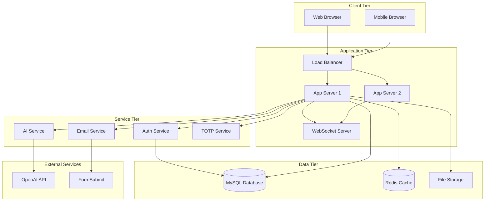

### 2. Component Architecture Diagram

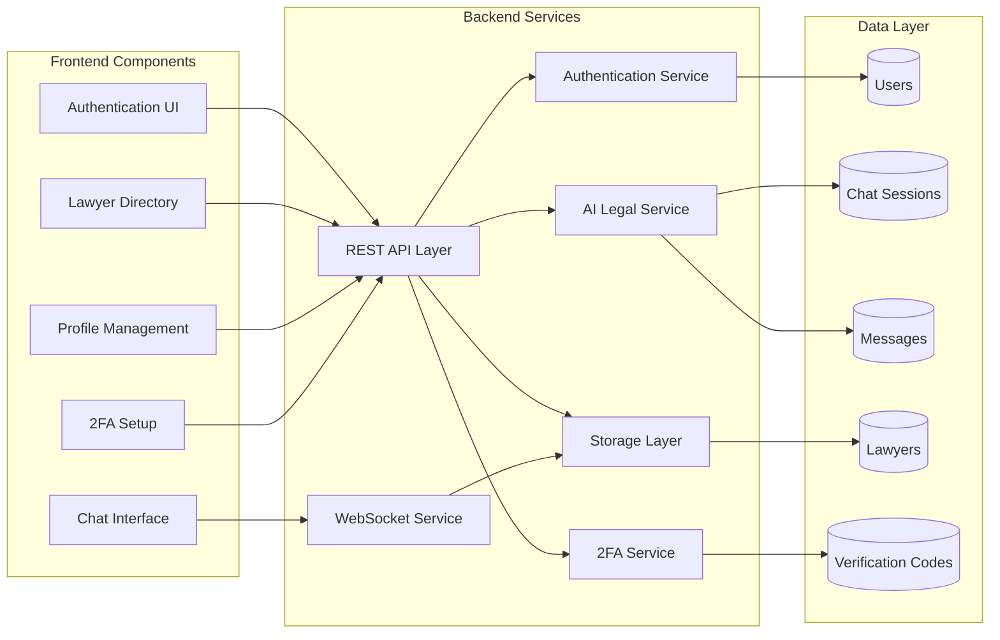

---

## Use Case Diagrams

### 1. User Authentication Use Cases

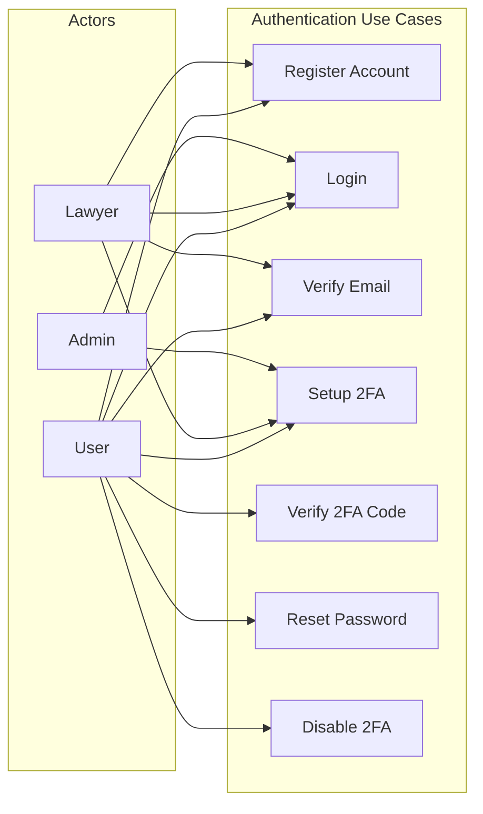

### 2. Legal Assistance Use Cases

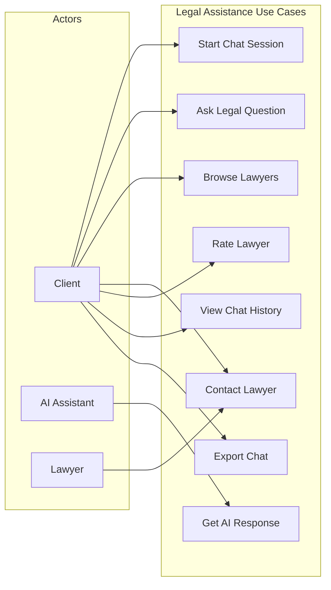

### 3. Lawyer Management Use Cases

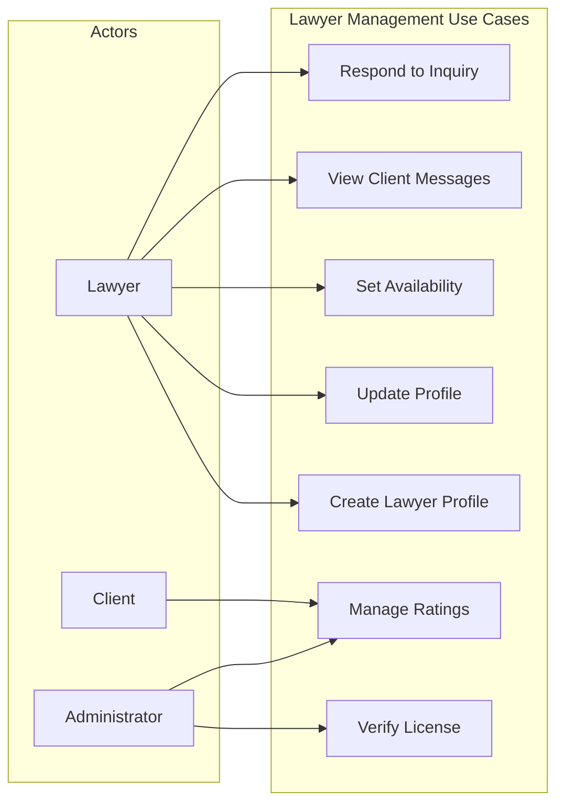

---

## Database Design

### 1. Entity Relationship Diagram

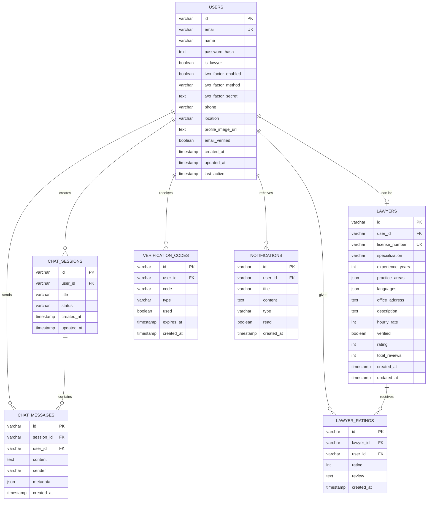

### 2. Database Schema Details

#### Users Table
- **Primary Key**: UUID for enhanced security
- **Unique Constraints**: Email address
- **Indexes**: Email, created_at, is_lawyer
- **Security**: Password hashed with bcrypt
- **2FA**: Supports both email and TOTP methods

#### Chat System Tables
- **Sessions**: Organize conversations by topic
- **Messages**: Store user and AI responses with metadata
- **Metadata**: AI confidence, references, disclaimers

#### Lawyer System Tables
- **Lawyers**: Professional profiles with verification
- **Ratings**: Client feedback and review system
- **JSON Fields**: Practice areas and languages arrays

#### Security Tables
- **Verification Codes**: Email verification, 2FA, password reset
- **Notifications**: System notifications and alerts

---

## Component Architecture

### 1. Frontend Architecture

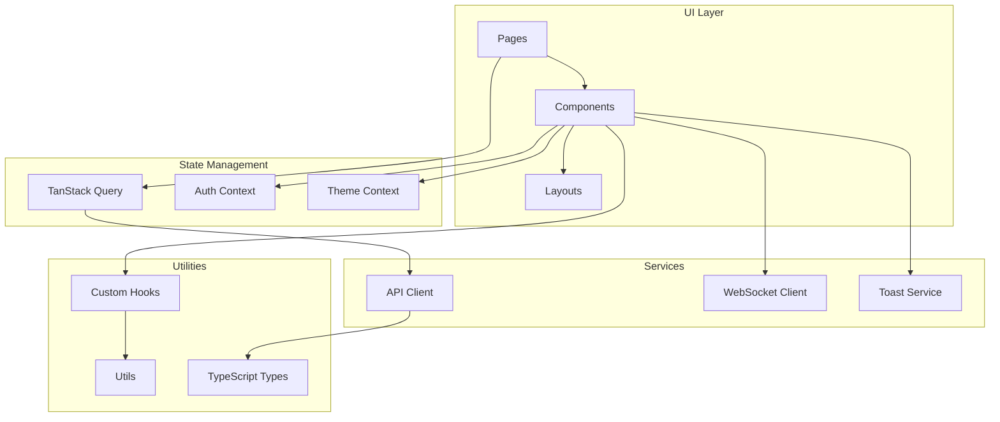

### 2. Backend Architecture

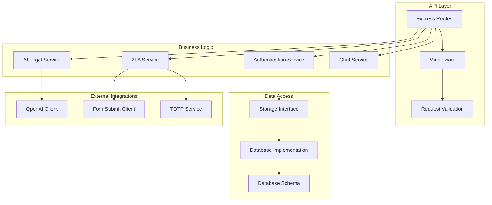

---

## Security Architecture

### 1. Authentication Flow

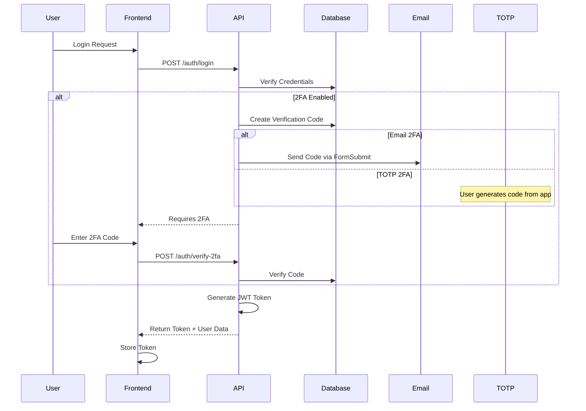

### 2. Security Layers

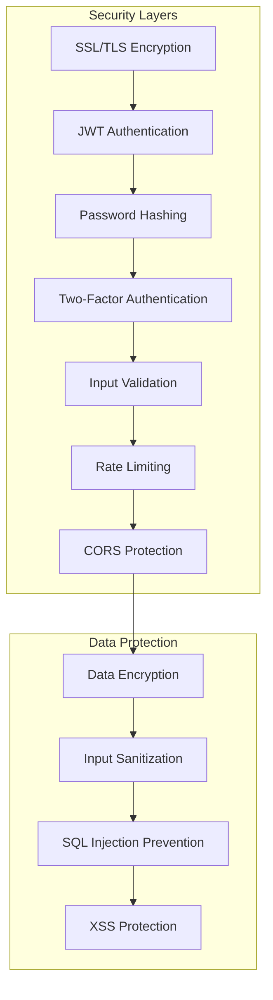

---

## Data Flow Diagrams

### 1. User Registration Flow

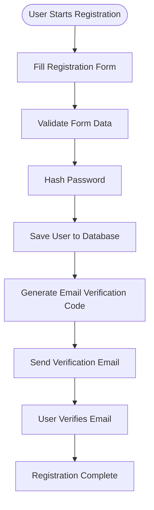

### 2. AI Chat Flow

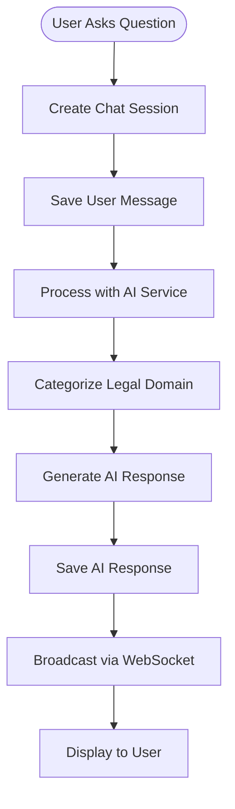

### 3. 2FA Setup Flow

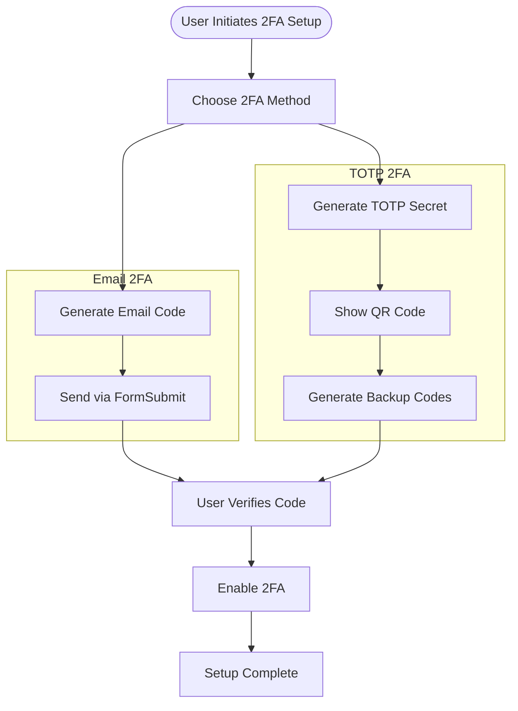

---

## Deployment Architecture

### 1. Development Environment

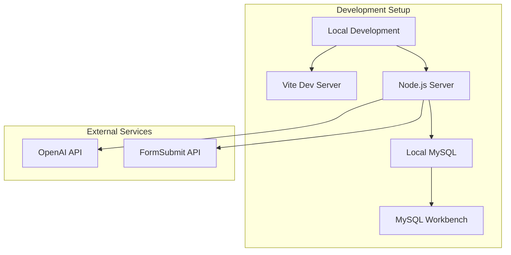

### 2. Production Environment

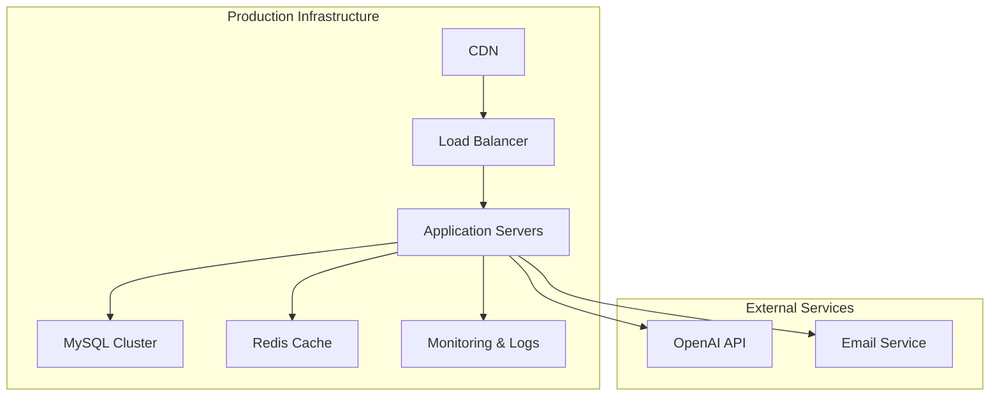

---

## API Documentation

### Authentication Endpoints

| Method | Endpoint | Description |
|--------|----------|-------------|
| POST | `/api/auth/register` | User registration |
| POST | `/api/auth/login` | User login |
| POST | `/api/auth/verify-email` | Email verification |
| POST | `/api/auth/verify-2fa` | 2FA verification |
| POST | `/api/auth/2fa/setup/email` | Setup email 2FA |
| POST | `/api/auth/2fa/setup/totp` | Setup TOTP 2FA |
| POST | `/api/auth/2fa/verify-setup` | Verify 2FA setup |
| POST | `/api/auth/2fa/disable` | Disable 2FA |

### User Management Endpoints

| Method | Endpoint | Description |
|--------|----------|-------------|
| GET | `/api/user/profile` | Get user profile |
| PATCH | `/api/user/profile` | Update user profile |
| GET | `/api/notifications` | Get user notifications |
| PATCH | `/api/notifications/:id/read` | Mark notification as read |

### Chat Endpoints

| Method | Endpoint | Description |
|--------|----------|-------------|
| POST | `/api/chat/sessions` | Create chat session |
| GET | `/api/chat/sessions` | Get user chat sessions |
| GET | `/api/chat/sessions/:id/messages` | Get session messages |

### Lawyer Endpoints

| Method | Endpoint | Description |
|--------|----------|-------------|
| GET | `/api/lawyers` | Get lawyers list |
| GET | `/api/lawyers/:id` | Get lawyer details |
| POST | `/api/lawyers/rating` | Rate a lawyer |

### WebSocket Events

| Event | Description | Payload |
|-------|-------------|---------|
| `auth` | Authentication | `{token, userId}` |
| `chat_message` | Send message | `{sessionId, content}` |
| `ai_response` | AI response | `{sessionId, message}` |
| `message_sent` | Message confirmation | `{messageId}` |
| `error` | Error notification | `{message}` |

---

## Performance Considerations

### Database Optimization
- UUID primary keys for security and distribution
- Proper indexing on frequently queried columns
- JSON columns for flexible schema evolution
- Connection pooling for efficient resource usage

### Caching Strategy
- Redis for session storage
- API response caching for lawyer listings
- Client-side caching with TanStack Query

### Security Measures
- JWT tokens with 7-day expiration
- bcrypt password hashing with salt rounds
- Rate limiting on authentication endpoints
- Input validation and sanitization
- SQL injection prevention with ORM

### Scalability Features
- Horizontal scaling with load balancers
- Database read replicas for query distribution
- WebSocket clustering for real-time features
- CDN for static asset delivery

---

## Monitoring and Analytics

### Application Metrics
- Response time monitoring
- Error rate tracking
- User session analytics
- Database performance metrics

### Security Monitoring
- Failed authentication attempts
- 2FA bypass attempts
- Unusual access patterns
- API rate limit violations

### Business Metrics
- User registration rates
- Chat session engagement
- Lawyer profile completions
- AI response accuracy feedback

---

This architecture documentation provides a comprehensive overview of the LawHelp system, covering all major components, data flows, security measures, and deployment strategies. The system is designed for scalability, security, and user experience while maintaining compliance with legal industry standards.